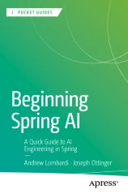

# Beginning Spring AI

[A Quick Guide to AI Engineering in Spring](https://link.springer.com/book/10.1007/979-8-8688-1291-0)

## Overview

Authors: Andrew Lombardi , Joseph Ottinger

* Takes a direct focus on pragmatic use of Spring AI
* Allows for quick access to a new Spring module within days
* Teaches how to efficiently onboard AI and LLM into real-world projects

## About this book

Discover how to use Large Language Models in the Spring Framework. This quick guide equips developers with insights into the strengths and limitations of Spring AI and how to leverage the model for typical use cases.

First, you will orient yourself to the new and exciting landscape of AI and Spring integration. You will learn how to issue simple queries, asking the right questions to get the results you want. From there, you will be empowered to select the right model for functionality and refinement, building a simple yet effective chat bot using real-world examples. Additionally, the book explores how to generate images, refine them, and how to send source images when appropriate. Lastly, the book focuses on how Spring AI and LLMs affect the developer landscape, including pitfalls and ethical concerns.

Designed for fast adoption, this book provides targeted guidance on integrating AI and LLMs into your projects within days. Through a pragmatic approach, it emphasizes direct utilization of the API.

### What You Will Learn

* Explore popular use cases for LLMs
* Gain insight into the Spring AI module, including its capabilities and limitations
* Know how to create effective queries and interactions for AI-driven conversations and image generation
* Discover strategies for selecting an appropriate LLM service and model
* Acquire skills to AI-proof your job and understand why it is NOT a replacement

### What This Book Is

Spring developers who are new to AI and focused on the essentials without exhaustive framework details. This is an optional supplement to the more comprehensive  Apress book, *Beginning Spring 6*.
